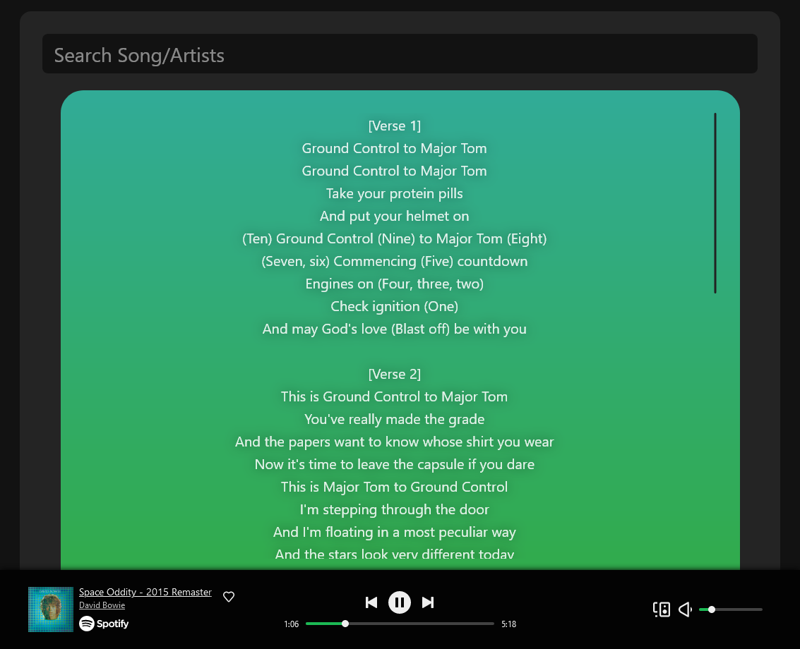
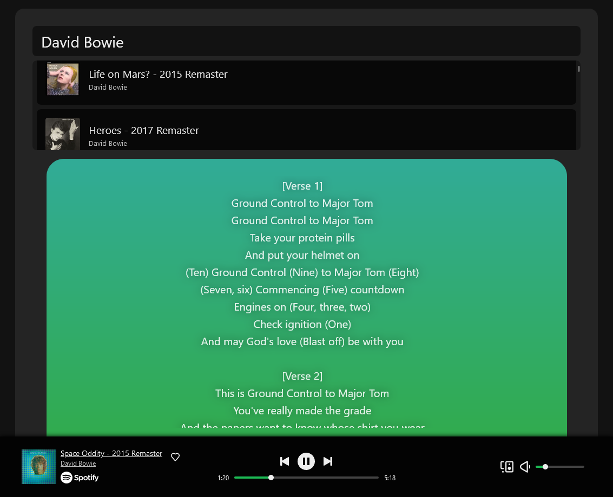
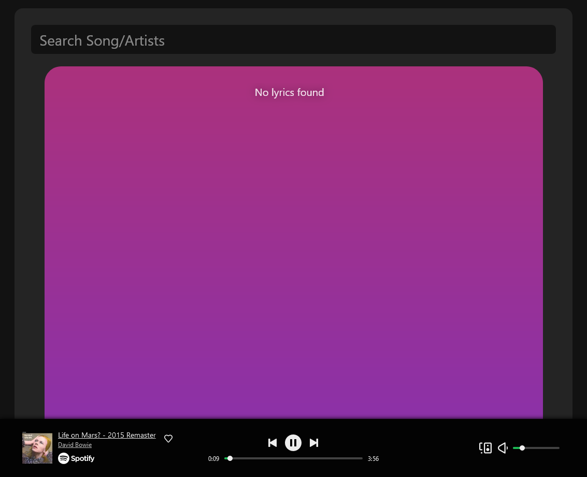

# Spotify Player

Developed by TJ Klimoski.

[Live demo](https://www.spotify-track-player.vercel.app) _(Does require a Spotify Premium account)_  
[Github](https://github.com/Tjklimoski/Spotify-player)

## About Spotify Player

A dynamic web application that facilates song discovery and playback through the Spotify API, along with real-time lyrics for the choosen track sourced through Genius.

Users securely sign into their Spotify account through the Spotify web API OAuth 2.0 authorization framework. This grants the user access to the application dashboard where they can search and play selected tracks. The lyrics container dynamically changes colors for each track, and playfully animates when revealing the lyrics.

## Technologies

Spotify player was built with:

- React
- Express
- Node
- Spotify Web API
- Genius (for lyrics)
- Javascript
- HTML
- CSS

## How to Run Locally

Clone repo:

    git clone https://github.com/Tjklimoski/Spotify-player.git

Install dependecies:

    npm i

Setup an account with [Spotify for Developers](https://developer.spotify.com/) and configure your project.

Add a `.env` file in the server directory:

    cd server; touch .env

Populate the server `.env` file with your Spotify Developer Project's information:

    CLIENT_ID=your_client_id
    CLIENT_SECRET=your_client_secret
    REDIRECT_URI=http://localhost:5173/ #The homepage of the app, not the server

Add a `.env` file in the client directory:

    cd client; touch .env

Populate the client `.env` file with your Spotify Developer Project's client ID:

    #PUBLIC VITE SPOTIFY CLIENT ID
    VITE_CLIENT_ID=your_client_id
    VITE_API_ORIGIN=http://localhost:3000/

Then, to run locally:

    npm run devStart

Both your server and client will start up, application available at http://localhost:5173/
